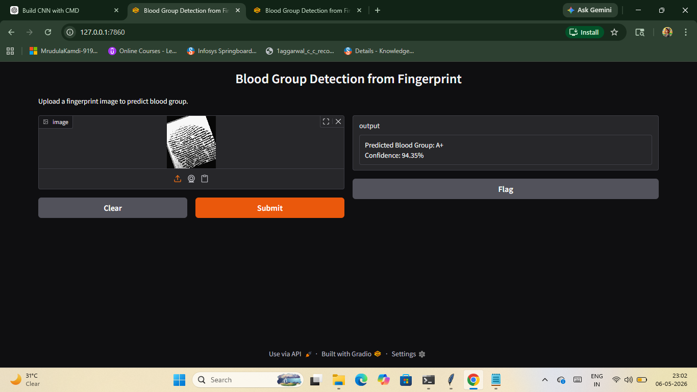

# Fingerprint Blood Group Classification using CNN

## Project Overview
This project presents a deep learning-based biometric classification system for predicting blood groups using fingerprint images. The system utilizes a Convolutional Neural Network (CNN) developed with PyTorch to analyze fingerprint patterns and classify blood groups.

The project includes image preprocessing, CNN model training, evaluation, and deployment through a Gradio web interface for real-time prediction.

---

## Application Preview


---

## Features
- Fingerprint image preprocessing and normalization
- CNN-based image classification using PyTorch
- Real-time blood group prediction
- Interactive Gradio deployment interface
- Model evaluation using confusion matrix and classification report
- Automated model saving using `.pth` checkpoint files

---

## Technologies Used
- Python
- PyTorch
- CNN (Convolutional Neural Network)
- Gradio
- NumPy
- Matplotlib
- Scikit-learn
- PIL (Python Imaging Library)

---

## Dataset
The dataset consists of fingerprint images categorized into multiple blood group classes:
- A+
- A-
- B+
- B-
- AB+
- AB-
- O+
- O-

The dataset was divided into:
- 80% Training Data
- 20% Testing Data

---

## Model Architecture
The CNN model contains:
- Convolution Layers
- ReLU Activation
- Max Pooling Layers
- Fully Connected Layers
- Softmax Output Layer

---

## Model Performance
| Metric | Value |
|---|---|
| Model Type | CNN |
| Framework | PyTorch |
| Accuracy Achieved | 78.21% |
| Deployment | Gradio |

---

## How to Run the Project

### 1️⃣ Install Required Libraries
```bash
pip install -r requirements.txt
```

### 2️⃣ Train the Model
```bash
python cnn_pytorch.py
```

### 3️⃣ Run the Gradio App
```bash
python app.py
```

## Deployment

The project is deployed using Gradio for real-time fingerprint image prediction.  
Users can upload a fingerprint image through the web interface, and the trained CNN model predicts the corresponding blood group.

---

## Project Structure

```text
blood_dataset/
│
├── app.py
├── cnn_pytorch1.py
├── fastcnn_model.pth
├── requirements.txt
├── confusion_matrix.png
├── train/
└── test/
```

---

## Future Improvements

- Improve classification accuracy using larger and balanced datasets
- Implement transfer learning techniques for better feature extraction
- Reduce class confusion between positive and negative blood groups
- Deploy the application on cloud platforms for public accessibility
- Develop a mobile-friendly interface for real-time prediction

---

##  Conclusion

This project demonstrates the application of deep learning and computer vision techniques in biometric-based blood group classification. The CNN model successfully performs fingerprint image analysis and provides real-time prediction through an interactive Gradio deployment interface.
